# Architecture Documentation

## Overview

The RemitWise smart contracts provide a comprehensive financial management system for remittance recipients. The architecture is designed to automatically allocate funds, manage recurring obligations, and support long-term financial goals.

## System Architecture

## Contract Relationships

### Core Contracts

### Data Flow

## Contract Details

### Remittance Split Contract

**Purpose**: Automatically divides incoming remittances into predefined categories.

**Key Features**:
- Configurable percentage allocation
- Default fallback configuration
- Real-time split calculations

**Integration Points**:
- Receives total remittance amount
- Outputs allocation amounts
- No dependencies on other contracts

### Bill Payments Contract

**Purpose**: Manages bill tracking, payment scheduling, and recurring payments.

**Key Features**:
- Recurring bill automation
- Payment tracking
- Due date management

**Integration Points**:
- Receives allocation from Remittance Split
- Stores bill data persistently
- Generates payment notifications

### Insurance Contract

**Purpose**: Manages micro-insurance policies and premium payments.

**Key Features**:
- Policy lifecycle management
- Premium payment scheduling
- Coverage tracking

**Integration Points**:
- Receives allocation from Remittance Split
- Manages policy data
- Handles premium collections

### Savings Goals Contract

**Purpose**: Manages goal-based savings with target dates and progress tracking.

**Key Features**:
- Goal creation and tracking
- Fund allocation
- Completion monitoring

**Integration Points**:
- Receives allocation from Remittance Split
- Tracks savings progress
- Provides goal status updates

## Integration Patterns

### Frontend Integration

### Batch Processing Pattern

### Error Handling Pattern

## Security Considerations

### Access Control

```mermaid
graph LR
    A[User] --> B[Authentication]
    B --> C[Authorization]
    C --> D{Contract Access}
    D --> E[Execute Function]
    D --> F[Access Denied]

    G[Admin] --> B
    H[Contract Owner] --> B
```

### Data Validation

- Input sanitization at contract boundaries
- Amount validation (positive values)
- Date validation (future dates for goals/bills)
- Percentage validation (sum to 100%)

### Storage Security

- Persistent data encryption where applicable
- Access control for sensitive operations
- Audit trail for financial transactions

## Performance Characteristics

### Gas Optimization

- Efficient data structures (Vec, Map)
- Minimal storage operations
- Batch processing for multiple items

### Scalability

- Contract isolation prevents cascading failures
- Horizontal scaling through multiple deployments
- Event-driven architecture for notifications

## Deployment Architecture

## Monitoring and Observability

### Key Metrics

- Contract invocation frequency
- Gas usage per function
- Error rates by contract
- User adoption rates
- Financial transaction volumes

### Logging Strategy

- Structured logging for all contract calls
- Error categorization and alerting
- Performance monitoring
- Audit trail generation

## Future Extensions

### Planned Enhancements

### Integration Points

- Banking APIs for direct bill payment
- Insurance providers for policy management
- Financial planning tools
- Remittance service providers
- Mobile money platforms